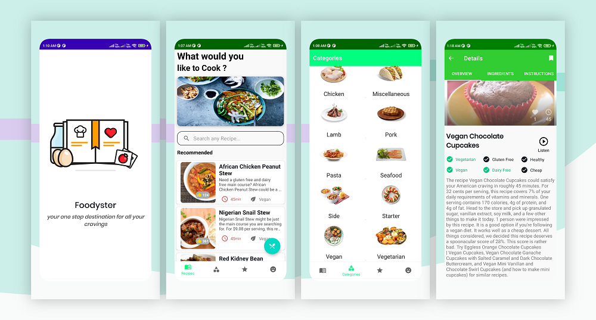
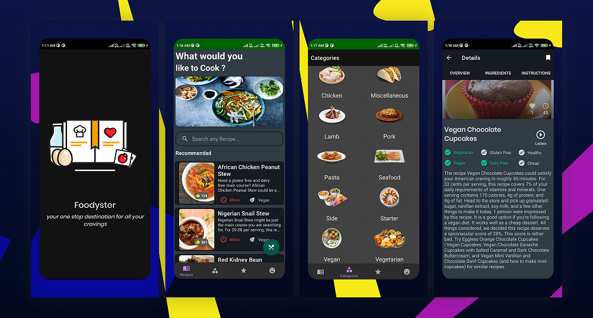
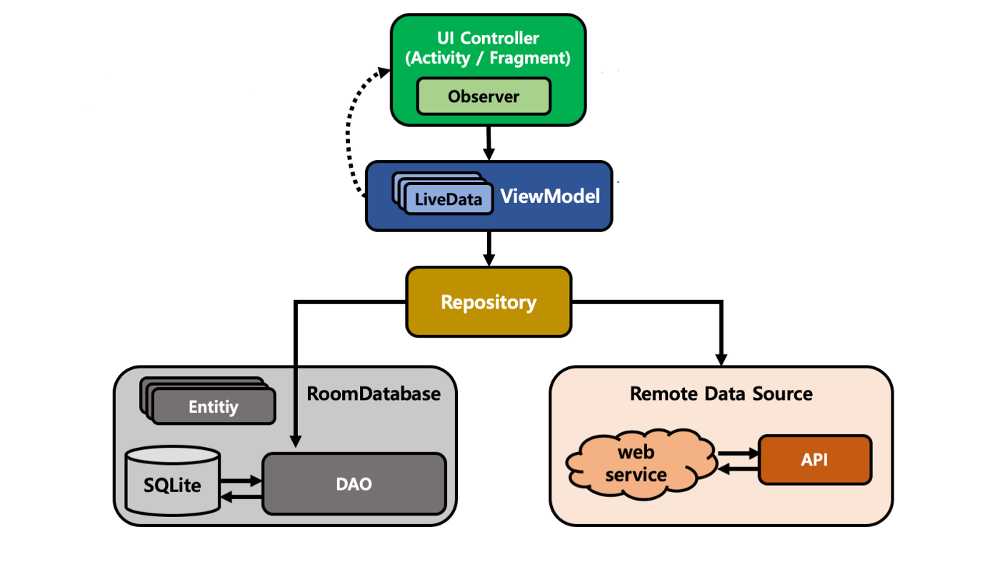

# Foodyster

Foodyster is a minimalistic food recipes app  📱 built to demonstrate the use of Modern Android development tools with MVVM Arvchitecture including Dependency Injection(Hilt),Flow , Retrofit , Room , Offline Caching and many more.

## Features 🚀

- Search any Recipe of your choice
- Pick among differnt Categories
- Listen to any Recipe on the Go
- Get detailed decription all the recipes
- Bookmark your favourite recipes.
- Get the recipes details within the application.
- Access the recipe using offline caching without internt connection
- Random Food Jokes to share it with your friends

# Screenshots

## Light Mode

  

#3 Dark Mode

  

## Built With 🛠

- [Kotlin](https://kotlinlang.org/) - First class and official programming language for Android development.
- [Coroutines](https://kotlinlang.org/docs/reference/coroutines-overview.html) - For asynchronous and more..
- [Android Architecture Components](https://developer.android.com/topic/libraries/architecture) - Collection of libraries that help you design robust, testable, and maintainable apps.
  - [LiveData](https://developer.android.com/topic/libraries/architecture/livedata) - Data objects that notify views when the underlying database changes.
  - [ViewModel](https://developer.android.com/topic/libraries/architecture/viewmodel) - Stores UI-related data that isn't destroyed on UI changes. 
  - [ViewBinding](https://developer.android.com/topic/libraries/view-binding) - Generates a binding class for each XML layout file present in that module and allows you to more easily write code that interacts with views.
  - [Room](https://developer.android.com/topic/libraries/architecture/room) - SQLite object mapping library.
- [Navigation Graph](https://developer.android.com/guide/navigation/navigation-design-graph) - The Navigation component uses a navigation graph to manage your app's navigation.  
- [Dagger 2](https://dagger.dev/) - Dependency Injection Framework
- [Retrofit](https://square.github.io/retrofit/) - A type-safe HTTP client for Android and Java.
- [Coil](https://github.com/coil-kt/coil/) - An image loading library for Android backed by Kotlin Coroutines.
- [Material Components for Android](https://github.com/material-components/material-components-android) - Modular and customizable Material Design UI components for Android.

## Architecture 🗼

This project follows the famous MVVM architecture and best practices from Google's 

  

## Requirements 🎯 
- Android 5.0 and Above
- Min sdk version 21

## Permissions 💻
- Internet

### If you liked the project don't forget to star 🌟 and fork 🍽 the project.

